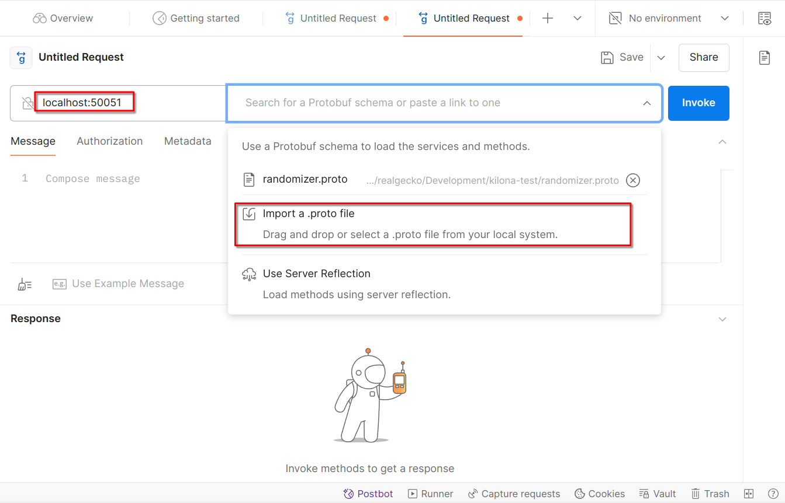
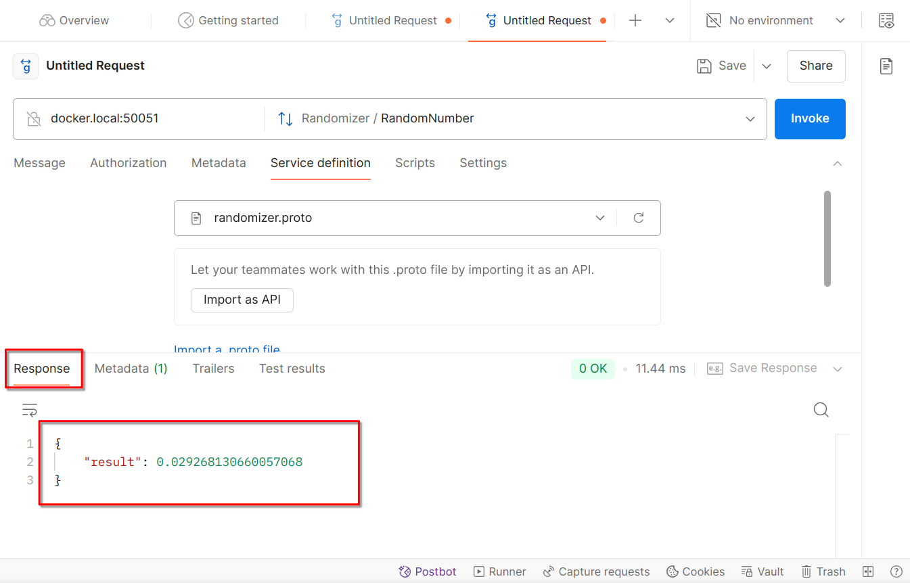

# Prerequisites
Make sure you have `docker` and `docker compose` installed
Create `.env` file in the root of the project and fill it with following variables
```env
POSTGRES_PASSWORD=<create one>
POSTGRES_USER=randomizer
POSTGRES_DB=randomizer
POSTGRES_HOST=db
```
You'll have to provide the password

# Building
Execute `docker compose up -d` to start the project
It'll:
- Pull database image
- Build gRPC server image
- Start everything

# Testing
gRPC server is available on the host port `50051`

Database server is available on the host port `5432`

[Postman](https://www.postman.com/downloads/) can be used for testing.
- Download and install postman
- Run Postman and execute `File -> New`
- Select `gRPC`
- In `Enter URL` field enter URL of your docker host with port number of gRPC server, eg: `localhost:50051`
- In `Select a method` field select `Import a .proto file`
- Select `randomizer.proto` file from `randomizer` directory



Now you can invoke `RandomNumber` method and see the result in `Response` tab



Connect to DB with login and password from `.env` file and make sure that `generated_numbers` table is populated with numbers from each `RandomNumber` call.

# Running tests with pytest
- While docker compose project is running connect to DB and create a new database eg: `randomizer_test`
- Copy contents of `.env` to new file `.test.env`
- Change value of `POSTGRES_DB` to `randomizer_test`
- Create virtualenv in project dir `python -m venv .venv`
- Activate the environment eg: `source .venv/bin/activate.fish`
- Execute `pip install -r requirements.txt`
- Execute `pytest`
